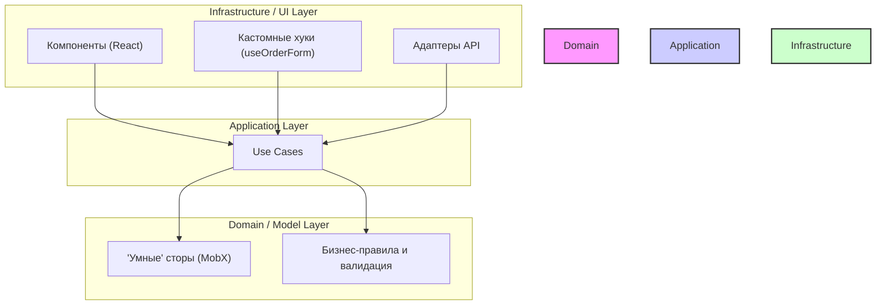
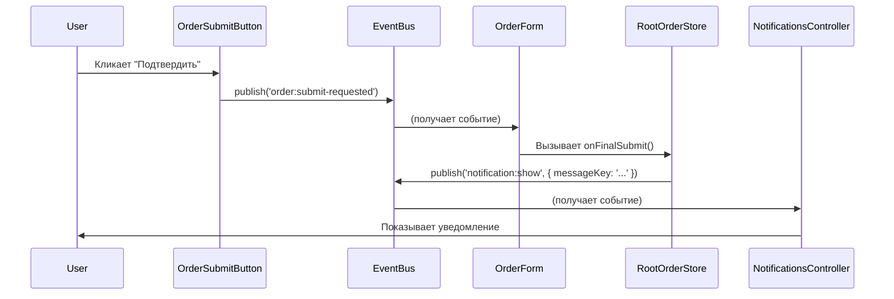

---
description:
globs: apps/frontend/**/*.ts*
alwaysApply: true
---

# Архитектура современного фронтенд-приложения

Это руководство описывает архитектурный подход для создания сложных,
масштабируемых и поддерживаемых фронтенд-приложений. Философия этого подхода
заключается в сочетании **вертикального среза (модульности)** с
**доменно-ориентированной слоистой архитектурой** и **реактивным
программированием**.

## 1. Ключевые принципы

1. **Вертикальный срез (Модульность):** Код группируется по бизнес-сущностям или
   фичам (`src/order`, `src/user`), а не по техническим типам (`components`,
   `stores`, `api`).
2. **Слоистая архитектура внутри модуля:** Каждый модуль имеет внутреннюю
   слоистую структуру, вдохновленную Чистой/Гексагональной архитектурой, для
   разделения ответственности.
3. **"Умная" доменная модель:** Ядром системы является доменный слой, который не
   только хранит состояние, но и инкапсулирует в себе бизнес-логику, валидацию и
   правила. Мы используем MobX, redux-toolkit, Zustand или другие подобные
   библиотеки для создания реактивных доменных моделей.
4. **Слабая связанность (Decoupling):** Модули взаимодействуют друг с другом
   через четко определенные публичные API (сторы) или через асинхронную
   событийную шину, что минимизирует прямые зависимости.

## 2. Архитектурные слои

В основе каждого модуля лежат три ключевых слоя, образующих "луковую"
архитектуру, где зависимости направлены строго внутрь.



- **Domain / Model Layer (Ядро):** Самый внутренний слой. Содержит состояние
  приложения, бизнес-правила и логику валидации. Не зависит ни от чего. В нашем
  подходе это "умные" MobX-сторы (или аналогичные структуры из других
  библиотек).
- **Application Layer:** Оркестрирует доменный слой для выполнения конкретных
  сценариев использования (use cases). Например, `updateOrderFieldUseCase`.
  Зависит только от доменного слоя.
- **Infrastructure / UI Layer:** Внешний слой. Содержит всё, что взаимодействует
  с внешним миром: React-компоненты, хуки, адаптеры для API, контроллеры для
  UI-эффектов (нотификации, модалки). Зависит от Application и Domain слоев.
- **Lib:** Библиотечные функции, мапперы, конверторы и прочее. Чистые функции и
  классы не относящиеся к бизнес-логике.

## 3. Структура модуля

```
/src
└── /order
    ├── /app
    │   └── update-order-field.use-case.ts  # Сценарии использования
    ├── /domain (или /model)
    │   ├── order.types.ts                  # Типы доменных моделей
    │   ├── order.errors.ts                 # Кастомные доменные ошибки
    │   ├── order.events.ts                 # Локальная шина событий модуля
    │   ├── order-item.model.ts             # Модель для вложенной сущности
    │   ├── order-data.store.ts             # Стор для данных
    │   ├── order-validation.store.ts       # Стор для логики валидации
    │   ├── order-rules.store.ts            # Стор для бизнес-правил
    │   └── root-order.store.ts             # Фасад, объединяющий сторы
    ├── /ui
    │   ├── order-form.tsx                  # Компонент формы
    │   ├── order-items-table.tsx           # Компонент таблицы
    │   └── use-order-form.ts               # Кастомный хук для логики формы
    ├── /infrastructure
    │   ├── /api
    │   │   ├── order.api.ts                # Реализация API-клиента
    │   │   └── order.types.ts              # Типы DTO
    │   └── /validation
    │       └── zod-order-validator.ts      # Адаптер для Zod
    └── /lib
        └── order.mapper.ts                 # Маппер
```

## 4. Взаимодействие модулей

Для обеспечения слабой связанности используется два основных паттерна:

1. **Чтение данных:** Один модуль (например,
   `/order/app/update-order-field.use-case.ts`) может напрямую зависеть от
   доменного слоя другого, более фундаментального модуля (например,
   `/user/domain`), импортируя его стор (`userStore`).
2. **Вызов действий:** Для вызова действий в другом модуле используется
   **событийная шина (Event Bus)**. Модуль-инициатор публикует событие
   (например, `order:created`), а другие модули подписываются на него и
   реагируют. Это обеспечивает нулевую прямую зависимость между модулями.

### Диаграмма взаимодействия через Event Bus



## 5. Полный пример: Форма заказа

Ниже приведен полный код для реализации сложной формы заказа.

### 5.1. Доменный слой (Сторы)

#### `order-data.store.ts` (Хранитель данных)

```typescript
import { makeAutoObservable } from 'mobx'
import { Order, OrderItem } from './order.types'

class OrderDataStore {
  public order: Order | null = null

  constructor() {
    makeAutoObservable(this)
  }

  public setOrder(order: Order): void {
    this.order = order
  }

  public updateField<K extends keyof Order>(field: K, value: Order[K]): void {
    if (this.order) {
      this.order[field] = value
    }
  }

  public updateItemQuantity(itemId: string, quantity: number): void {
    if (!this.order) return

    const item = this.order.items.find(i => i.id === itemId)

    if (item) {
      item.quantity = quantity
    }
  }

  public zeroOutItemQuantities(): void {
    if (this.order) {
      this.order.items.forEach(item => (item.quantity = 0))
    }
  }
}
```

#### `order-rules.store.ts` (Хранитель бизнес-правил)

```typescript
import { reaction } from 'mobx'
import { OrderDataStore } from './order-data.store'

class OrderRulesStore {
  constructor(private dataStore: OrderDataStore) {
    reaction(
      () => this.dataStore.order?.supplierId,
      () => {
        if (this.dataStore.order) {
          this.dataStore.zeroOutItemQuantities()
        }
      },
    )
  }
}
```

#### `order-validation.store.ts` (Валидатор)

```typescript
import { makeAutoObservable, reaction } from 'mobx'
import { OrderDataStore } from './order-data.store'
import { Order, OrderErrors } from './order.types'
import { IValidator } from './i-validator'

class OrderValidationStore {
  public errors: OrderErrors = {}

  constructor(
    private dataStore: OrderDataStore,
    private validator: IValidator<Order>,
  ) {
    makeAutoObservable(this)
    reaction(
      () => this.dataStore.order,
      order => {
        if (order) this.runValidation(order)
      },
      { fireImmediately: true },
    )
  }

  private runValidation(order: Order): void {
    const result = this.validator.validate(order)
    this.errors = result.errors
  }

  public get isValid(): boolean {
    if (!this.dataStore.order) return false
    // Проверяем ошибки.
    // Вся логика валидации, включая проверку инвариантов (например, quantity > 0),
    // должна быть инкапсулирована в реализации IValidator (например, в Zod схеме).
    // Это делает store более простым и собирает все правила в одном месте.
    return Object.values(this.errors).every(e => !e)
  }
}
```

#### `root-order.store.ts` (Фасад)

```typescript
import { makeAutoObservable } from 'mobx'
import { IOrderApi } from '../infrastructure/api/order.api'
import { OrderDataStore } from './order-data.store'
import { OrderValidationStore } from './order-validation.store'
import { OrderRulesStore } from './order-rules.store'
import { ZodOrderValidator } from '../infrastructure/validation/zod-order-validator'

class RootOrderStore {
  public data: OrderDataStore
  public validation: OrderValidationStore
  public rules: OrderRulesStore

  constructor(private api: IOrderApi) {
    const orderValidator = new ZodOrderValidator()
    this.data = new OrderDataStore()
    this.validation = new OrderValidationStore(this.data, orderValidator)
    this.rules = new OrderRulesStore(this.data)

    makeAutoObservable(this)
  }
}
```

### 5.2. UI Слой

#### `use-order-form.ts` (Кастомный хук)

```typescript
import { useEffect, useCallback } from 'react'
import { useForm } from 'react-hook-form'
import { observer } from 'mobx-react-lite'
import { Order } from '../domain/order.types'
// ... импорты сторов, use case, event bus ...

// Компонент, использующий хук, должен быть обернут в `observer`
export const useOrderForm = () => {
  const { order } = rootOrderStore.data
  const { isValid } = rootOrderStore.validation

  const {
    control,
    handleSubmit,
    getValues,
    formState: { isDirty },
    reset,
    setValue,
  } = useForm<Order>({
    values: order || undefined,
    mode: 'onChange',
  })

  // ✅ Синхронизация изменений из MobX в react-hook-form
  useEffect(() => {
    if (order) {
      reset(order)
    }
  }, [order, reset])

  // ... остальная логика хука ...

  const onFinalSubmit = useCallback(async (data: Order) => {
    // ...
  }, [])

  return { control, getValues, setValue }
}
```

---

## 6. Продвинутые темы и расширения

### 6.1. Управление вложенными сущностями (Паттерн "Агрегат")

**Принцип:** `OrderItem` перестает быть простым объектом и становится классом
`OrderItemModel` со своим состоянием, поведением и валидацией.

#### `order-item.model.ts`

```typescript
import { makeAutoObservable } from 'mobx'
import { OrderItem } from './order.types'

export class OrderItemModel {
  public readonly id: string
  public readonly name: string
  public readonly price: number
  public quantity: number
  public errors: { quantity?: string } = {}

  constructor(itemData: OrderItem) {
    this.id = itemData.id
    this.name = itemData.name
    this.price = itemData.price
    this.quantity = itemData.quantity
    makeAutoObservable(this)
  }

  public setQuantity(quantity: number): void {
    this.quantity = quantity
    this.validate()
  }

  public validate(): void {
    this.errors.quantity =
      this.quantity <= 0 ? 'Количество должно быть больше нуля' : undefined
  }

  public get lineTotal(): number {
    return this.price * this.quantity
  }

  public get isValid(): boolean {
    return !this.errors.quantity
  }
}
```

### 6.2. Продвинутая валидация с помощью Zod

Чтобы не нарушать чистоту архитектуры, мы внедряем валидатор как внешнюю
зависимость.

1. **Определяем абстракцию `IValidator`:**

   ```typescript
   export interface ValidationResult<T> {
     success: boolean
     errors: { [K in keyof Partial<T>]: string | null }
   }

   export interface IValidator<T> {
     validate(data: T): ValidationResult<T>
   }
   ```

2. **Создаем адаптер `ZodOrderValidator`:**

   ```typescript
   import { z } from 'zod'
   import { IValidator, ValidationResult } from '../../domain/i-validator'
   import { Order, orderSchema } from '../../domain/order.schema'

   export class ZodOrderValidator implements IValidator<Order> {
     public validate(data: Order): ValidationResult<Order> {
       const result = orderSchema.safeParse(data)
       if (result.success) {
         return { success: true, errors: {} }
       }

       // ✅ Используем встроенный метод Zod для получения плоского списка ошибок по полям.
       // Это безопасно работает для вложенных полей и массивов.
       const fieldErrors = result.error.flatten().fieldErrors
       const formattedErrors: ValidationResult<Order>['errors'] = {}

       for (const key in fieldErrors) {
         // Убеждаемся, что ключ принадлежит объекту, а не его прототипу
         if (Object.prototype.hasOwnProperty.call(fieldErrors, key)) {
           const typedKey = key as keyof Order
           const messages = fieldErrors[typedKey as keyof typeof fieldErrors]

           // Берем первое сообщение для простоты
           if (messages && messages.length > 0) {
             formattedErrors[typedKey] = messages[0]
           }
         }
       }
       return { success: false, errors: formattedErrors }
     }
   }
   ```

### 6.3. Антикоррупционный слой: Маппинг DTO

Слой мапперов защищает домен от изменений в контрактах API.

#### `order.mappers.ts`

```typescript
import { Order, OrderItem } from '../domain/order.types'
import { OrderDto, OrderItemDto } from '../infrastructure/api/order.types'

export function mapOrderDtoToModel(dto: OrderDto): Order {
  return {
    id: dto.order_uid,
    supplierId: dto.vendor_id,
    departmentId: dto.dept_id,
    comments: dto.notes,
    createdAt: new Date(dto.created_at),
    items: dto.line_items.map(
      (itemDto): OrderItem => ({
        id: itemDto.product_id,
        name: itemDto.product_name,
        price: itemDto.item_price,
        quantity: itemDto.qnt,
      }),
    ),
  }
}

export function mapOrderModelToDto(model: Order): OrderDto {
  return {
    order_uid: model.id,
    vendor_id: model.supplierId,
    dept_id: model.departmentId,
    notes: model.comments,
    created_at: model.createdAt.toISOString(),
    line_items: model.items.map(
      (itemModel): OrderItemDto => ({
        product_id: itemModel.id,
        product_name: itemModel.name,
        item_price: itemModel.price,
        qnt: itemModel.quantity,
      }),
    ),
  }
}
```

### 6.4. Доменные ошибки и их обработка

1. **Кастомные классы ошибок** (`order.errors.ts`) делают обработку нарушений
   бизнес-правил типизированной и надежной.

   ```typescript
   export class DomainError extends Error {
     /* ... */
   }
   export class CommentTooLongError extends DomainError {
     /* ... */
   }
   ```

2. **Асинхронные ошибки** ловятся в `try/catch (e: unknown)` в use case или
   хуках.
3. **Ошибки рендеринга** ловятся компонентом **ErrorBoundary**, который может
   по-разному реагировать на разные типы доменных ошибок.

### 6.5. Доменные события и событийная шина

Рекомендуется **гибридный подход**:

1. **Локальная шина событий (на уровне модуля):** Для **внутримодульных**
   реакций (`orderEventBus`).
2. **Глобальная шина событий (`appEventBus`):** Исключительно для
   **межмодульного** взаимодействия.

### 6.6. Автоматизация и контроль

1. **Генерация кода (Scaffolding):** Используйте **`plop.js`** или **`hygen`**
   для создания шаблонов модулей.
2. **Архитектурные тесты:** Используйте **`dependency-cruiser`** для создания
   правил, запрещающих невалидные зависимости. Эти тесты в CI/CD гарантируют,
   что архитектура не "разлагается" со временем.
